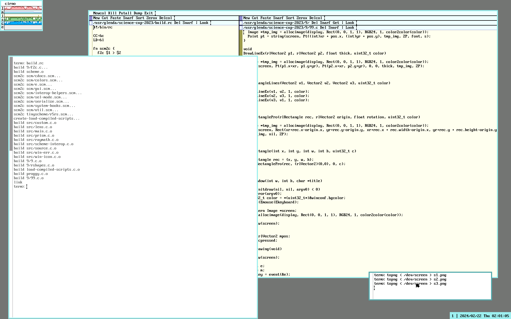

```shell
% build.rc
% lambda-optyka-plan9
```

- `9/9.c` - deklaracje wymaganych funkcji
- `9/99.c` - deklaracje wymaganych funkcji związanych z grafiką




<video controls width="640" height="400" src="https://git.krzysckh.org/kpm/msc9/raw/branch/master/99999.mp4" type="video/mp4" />
